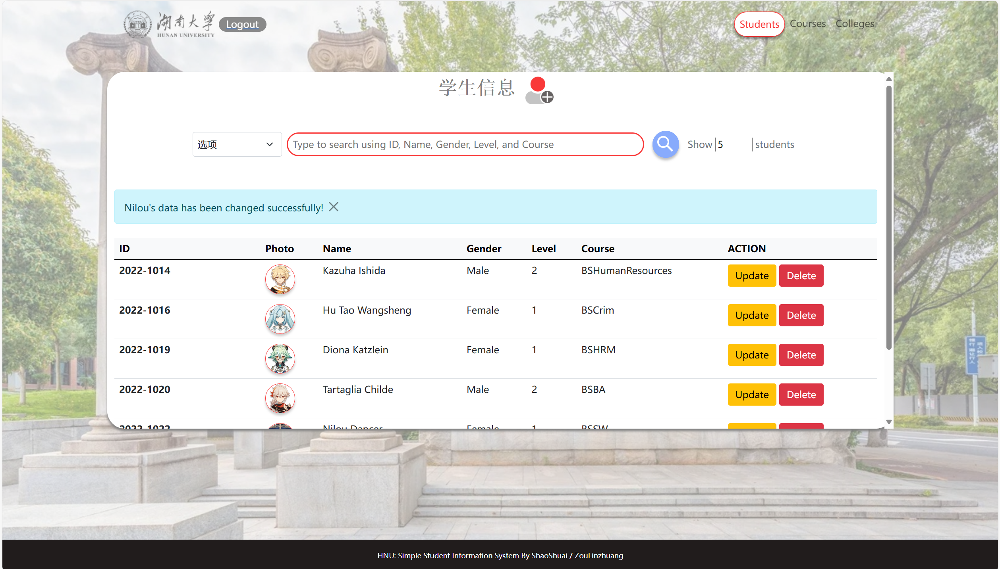
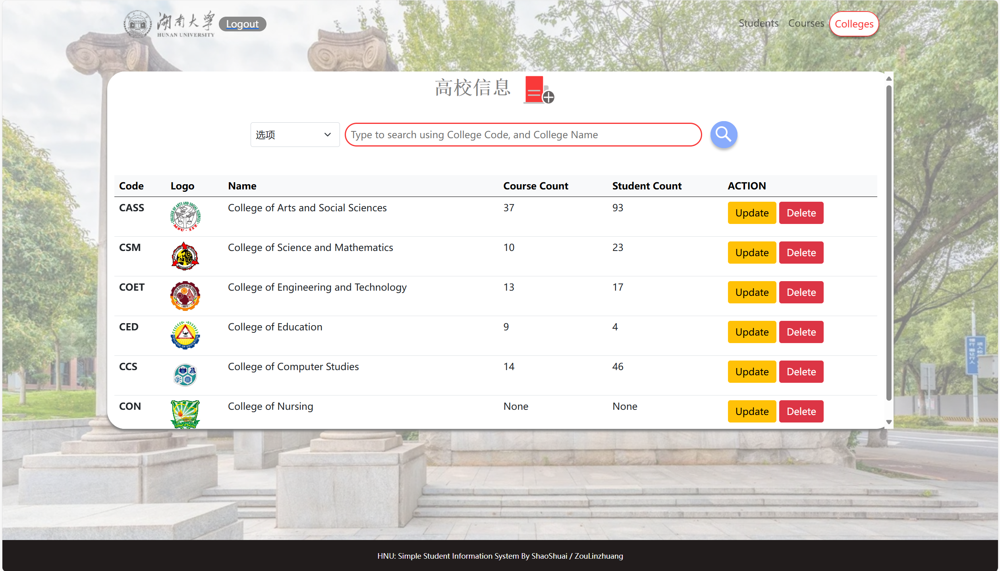

# 数据库原理大作业

## 功能展示

登录界面


注册界面


学生界面



专业界面


高校界面



其中，学生模块、专业模块和高校模块都支持：

- 显示数据
- 添加数据
- 编辑数据
- 删除数据
- 搜索数据

## 环境配置

如果你是在服务器上运行，请确保你拥有 `sudo` 权限

克隆存储库到本地

```shell
git clone https://github.com/xzxg001/Student_management_system.git
```

安装所需的依赖

```shell
cd Student_management_system
sudo pip install -i https://pypi.tuna.tsinghua.edu.cn/simple virtualenv # 安装 virtualenv
python3 -m venv flaskenv # 创建虚拟环境
source venv/bin/activate # 启用虚拟环境
pip install -r requirements.txt
```

创建一个 `.env` 文件

```shell
type nul > .env
```

打开这个 `.env` 文件，输入以下内容

```shell
DB_HOST=your_database_host # 改为localhost或127.0.0.1
DB_NAME=ssisdb
DB_USERNAME=your_database_username # 需要更改
DB_PASSWORD=your_database_password # 需要更改
SECRET_KEY=any_string_will_do

# 需要进入 https://console.cloudinary.com 网站，注册后将账户信息并复制到本文件中，否则上传的 studnet 图片无法显示
#主要是创建云端存储图片信息
CLOUD_NAME = your_cloudinary_name # 需要更改
API_KEY = your_cloudinary_api_key # 需要更改
API_SECRET = your_cloudinary_api_secretkey # 需要更改
PHOTO_UPLOAD = cloud
```

创建一个 `.flaskenv` 文件

```shell
type nul > .flaskenv
```

打开这个 `.flask` 文件，输入以下内容

```shell
FLASK_APP=ssis
FLASK_ENV=development
FLASK_RUN_PORT=8080
```

执行 SQL 脚本

```shell
mysql -u root -p
mysql > source /home/ss/Database_Web_System/db_script/script.sql # 请更改路径名
mysql > quit
```

## 运行程序

```shell
flask run
```

#说明
本项目是一个基于Flask的学生管理系统，实现了学生、专业、高校的增删改查功能，并使用了云端存储图片功能。
借鉴了https://github.com/edenroseFR/Web-based-SSIS项目，我和ss一起完成了该项目